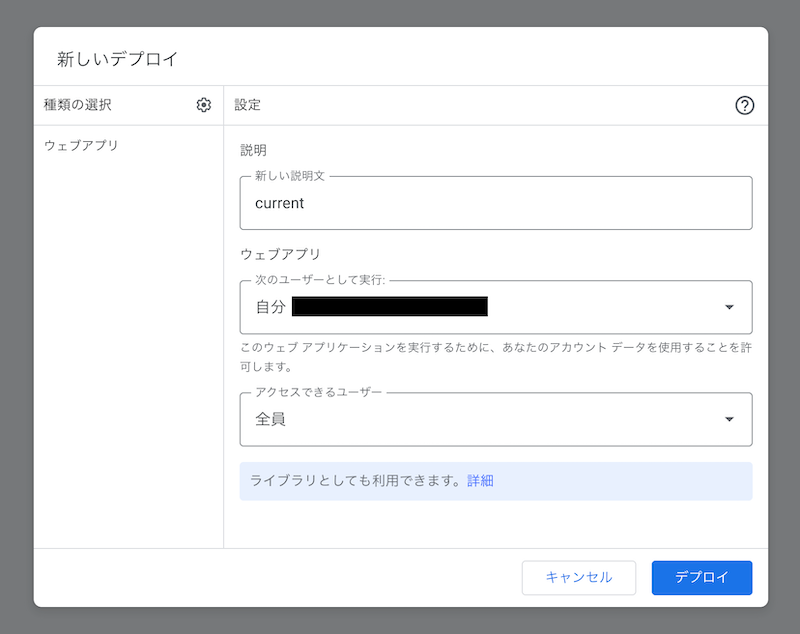

# auto-ticket-issuer

Sample project creating a Backlog ticket when a GitHub Pull Request is opened.

## 開発方法

### 環境構築

#### Clasp をセットアップ

```shell
npm i -g @google/clasp
```

```shell
clasp login
```

#### 依存パッケージをインストール

```shell
npm i
```

#### スクリプトをセットアップ

Clasp でスクリプトを作成

```shell
mkdir dist && clasp create \
  --type webapp \
  --title "@kzmshx/auto-ticket-issuer" \
  --rootDir "dist"
```

設定ファイルを移動

```shell
mv dist/appsscript.json src/appsscript.json
mv dist/.clasp.json .clasp.json
```

`appsscript.json` の `timeZone` を変更

```shell
cat src/appsscript.json | jq '.timeZone |= "Asia/Tokyo"' | tee src/appsscript.json
```

#### デプロイ（初回）

初回は以下のようにソースをビルドし、プッシュする。

```shell
npm run build && npm run push
```

コンソールでソースがプッシュされていることを確認したら、以下の設定でウェブアプリケーションとしてデプロイする。
`説明` を `current` にしてデプロイすると `npm run redeploy` がそのデプロイを対象に再デプロイを行えるようになる。

- 説明
    - `current`
- 次のユーザーとして実行
    - 自分
- アクセスできるユーザー
    - 全員



ウェブアプリケーションとしてデプロイすると `appsscript.json` に `webapp` フィールドが追加されるので、一度 `clasp pull` を実行する。

```shell
clasp pull && mv dist/appsscript.json src/appsscript.json
```

#### デプロイ（2回目以降）

一度コンソール上でウェブアプリケーションとしてデプロイすることで、次回以降の再デプロイはコマンドラインで行えるようになる。

```shell
npm run all
```

### 環境変数（`.env`）の設定

| 変数名              | 値                 | 備考                                   |
|:-----------------|:------------------|:-------------------------------------|
| GITHUB_TOKEN     | GitHub のアクセストークン  | Pull Request のタイトルやブランチを変更するために使われる  |
| BACKLOG_API_KEY  | Backlog の API キー  | Backlog にチケットを新規追加するために使われる          |
